# Set up

> ### **An official branding website of a goal-setting productivity tool**
>
> [View website >>](https://pcshen0828.github.io/tfd104_project1/)

### **Techniques**

**Front-End Fundamental**

- HTML
- CSS
- JavaScript
- RWD

**Libraries**

- jQuery
- Slick.js

### **Achievements**

- Owned the whole project independently from ideation, branding, design to development within one month as a beginner
- Realized responsive web design using CSS Flexbox and grid system
- Improved interactivity of the website using localStorage to memorize the names inputed by users

### **Concepts**

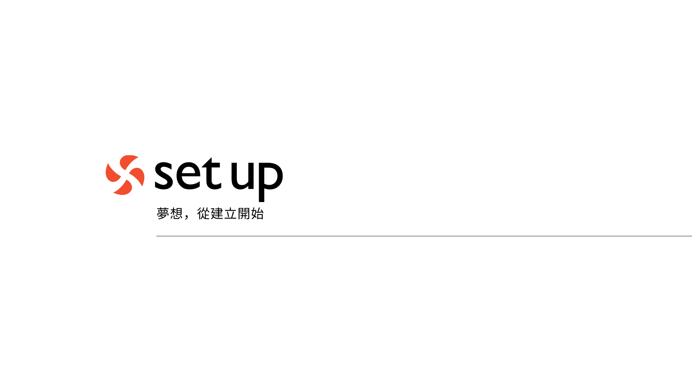
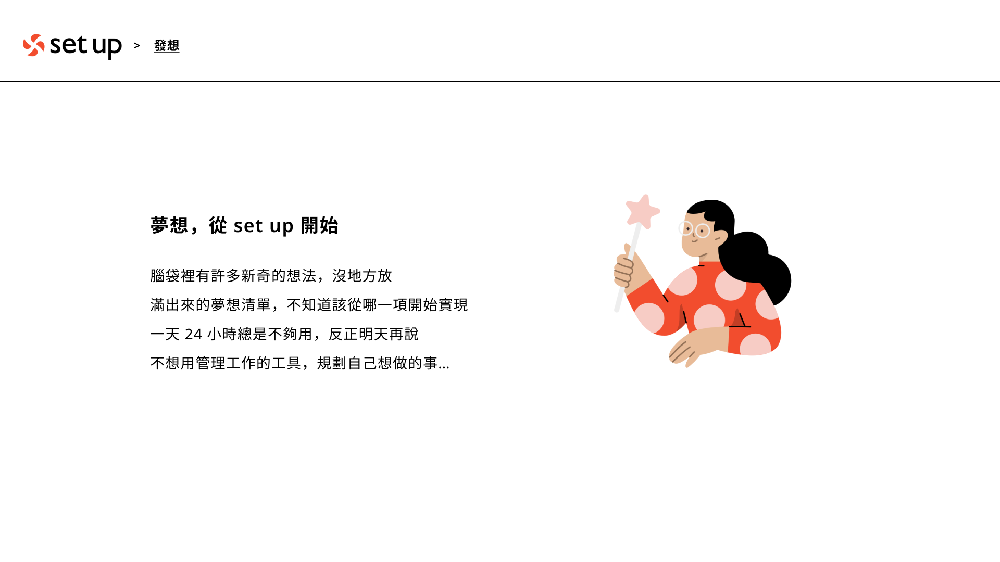
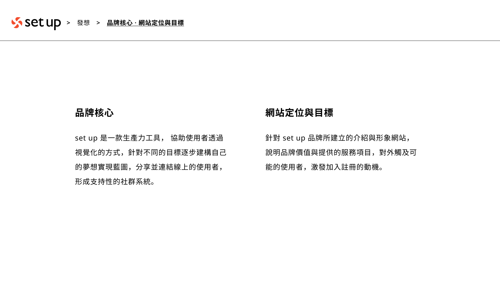
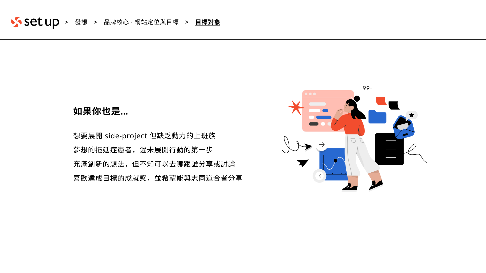
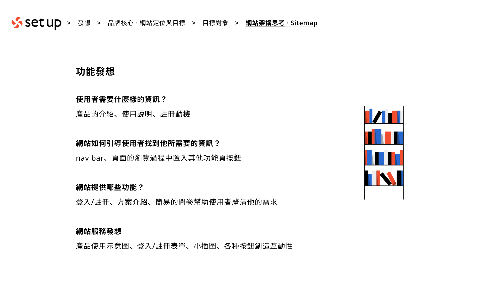
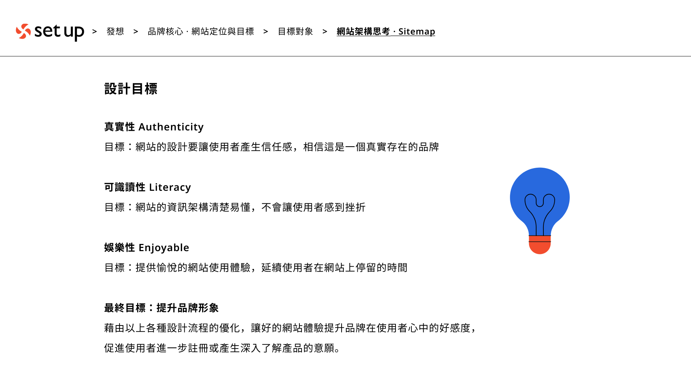
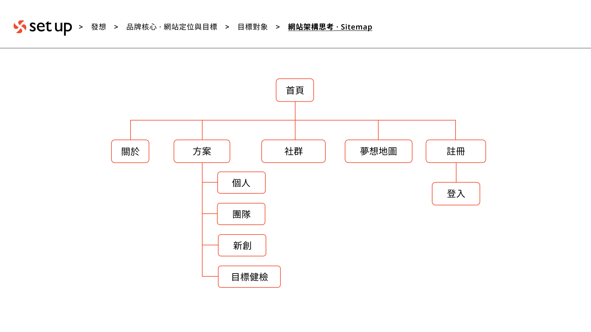
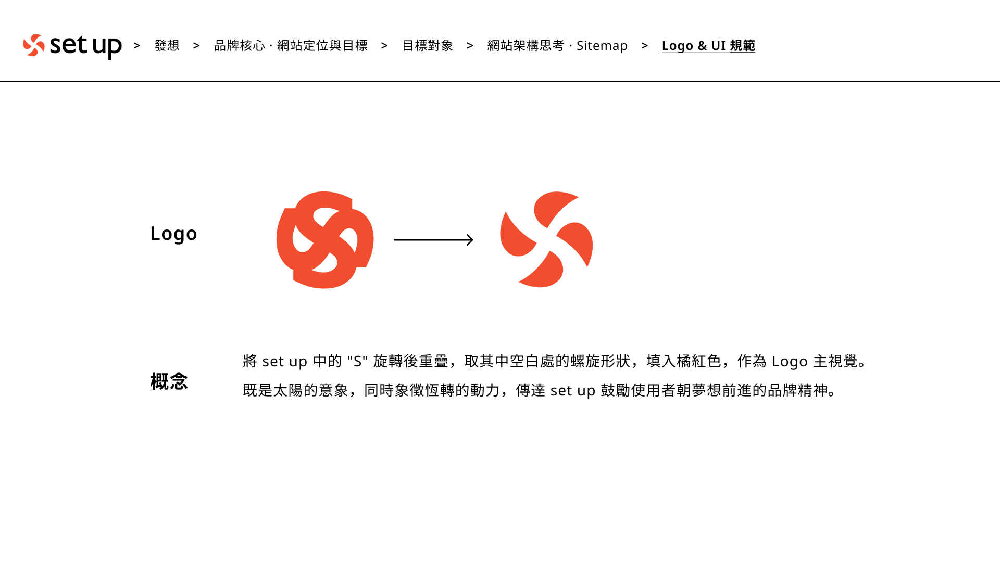
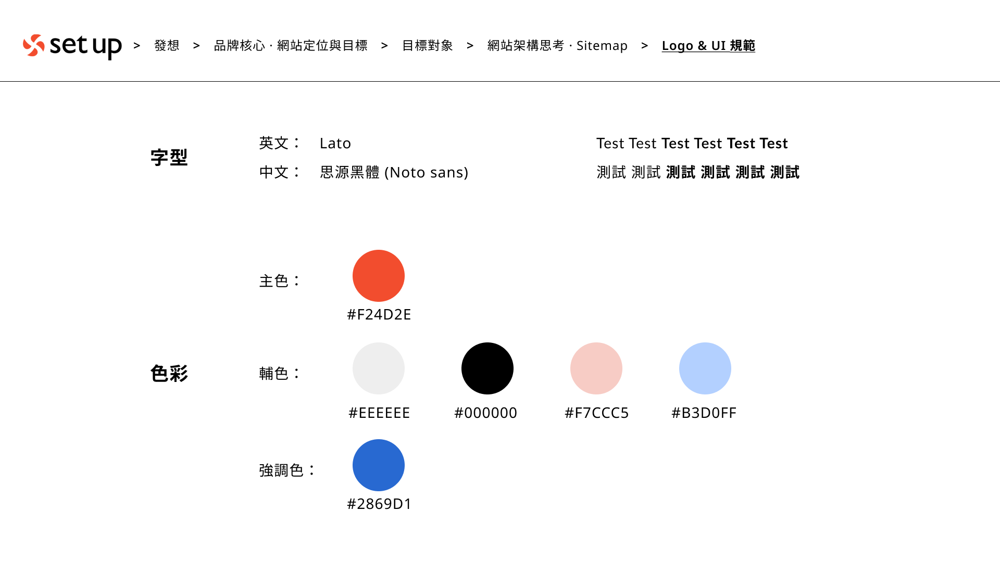
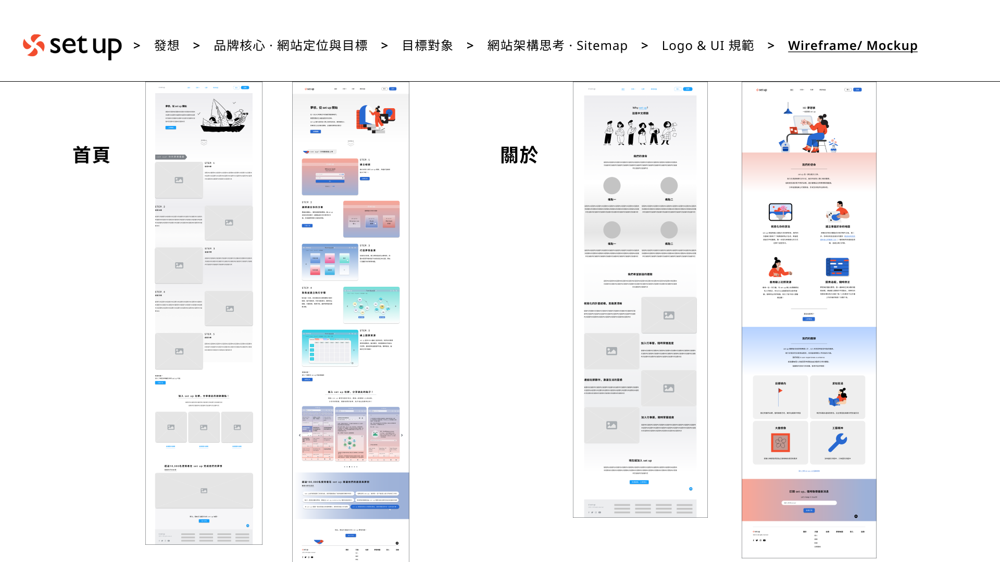
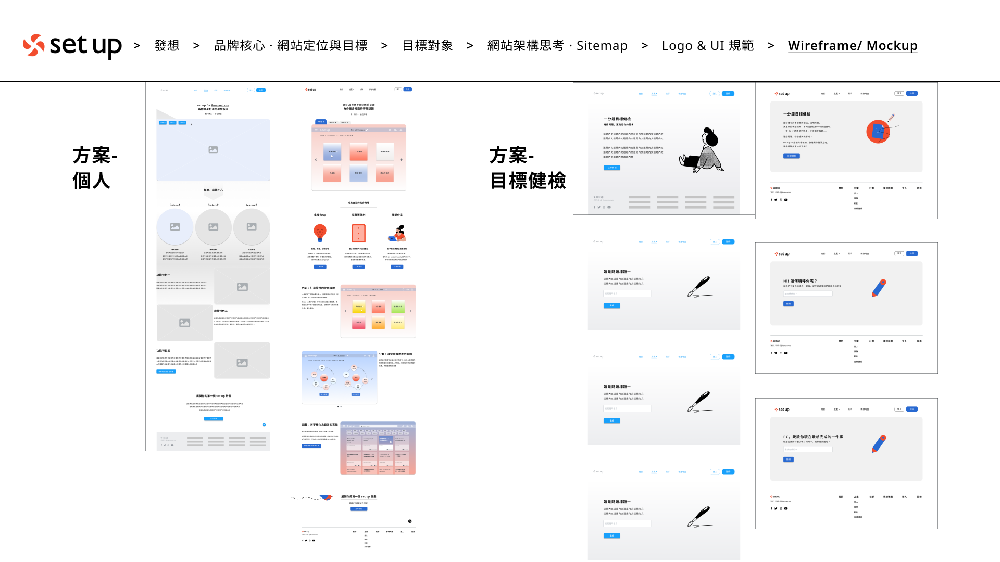
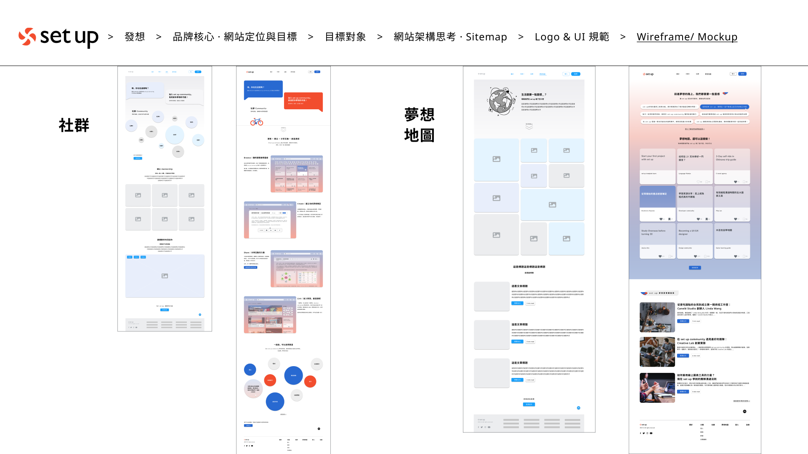
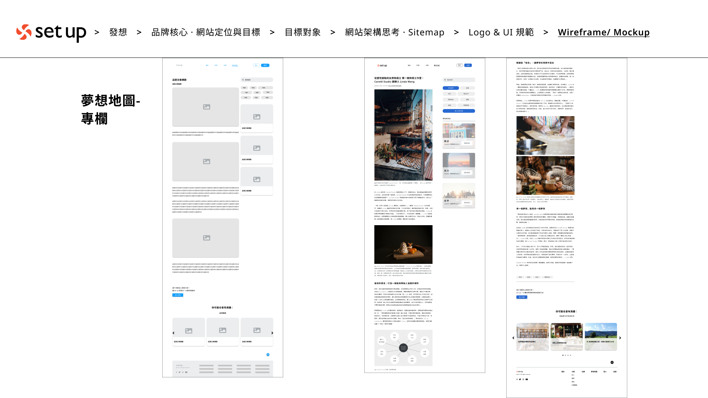

### **Afterword**

This is my first front-end project to practice skills of web design and layouts.

I brainstormed an online productivity-tool brand called "set-up", which provides charts and mind maps with diversity to help the users to manage plans and achieve their dream goals.

The website is designed to demonstrate the concepts of the brand to its users, which contains the feature introductions, brand story, user experiences, etc.

Although the contents so far is all fictional, I'm looking forward to make "set-up" a real running app in the future!

### **Contact**

michelleshen0828@gmail.com
